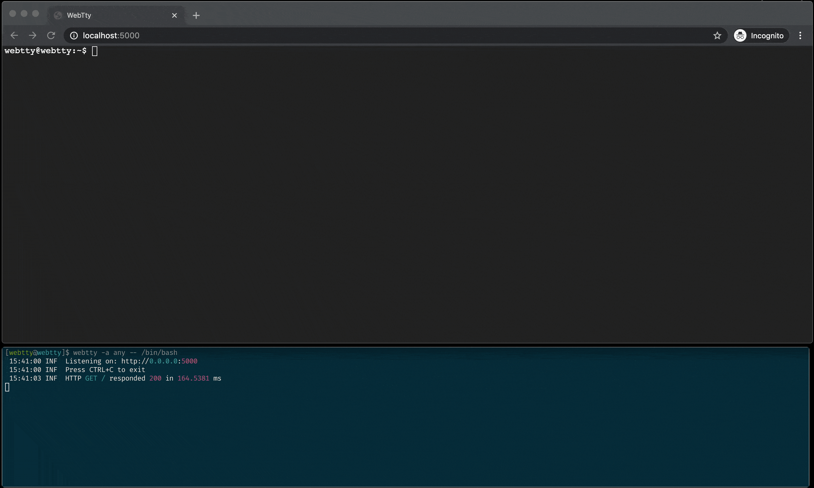

# WebTty

[![Build status][ci-badge]][ci-url]
[![NuGet][nuget-package-badge]][nuget-package-url]
[![feedz.io][feedz-package-badge]][feedz-package-url]
[![coverage][coverage-badge]][coverage-url]

> A TeleTYpewriter for the web.




## Introduction
WebTty is a simple command-line tool that's inspired by GoTTY, mostly a learning experience about how terminals work internally. Built with ASP.NET and XTerm.js the tool allows turning any CLI tool into a web application. In short a TeleTYpewriter for the web that runs on any modern browser or platform.

## Installation

### Dotnet tool
Download [.NET Core 3.1](https://dotnet.microsoft.com/download) or newer. Once installed, run this command:

```sh
dotnet tool install -g webtty
```

### Native
```sh
curl -L -o webtty{.exe} https://github.com/nickvdyck/webtty/releases/download/{VERSION}/webtty.{PLATFORM}
```
You can replace the version portion by one of the releases found on GitHub.
The platform can be replaced with a supported [dotnet RID](https://docs.microsoft.com/en-us/dotnet/core/rid-catalog), this represents the platform you want the tool to run on. The following ones are supported:
- osx-x64
- linux-x64
- linux-musl-x64 (alpine)
- win-x64

#### Ubuntu dependencies
```sh
apt update
apt install libicu60 libssl1.0.0
```

### Local build (Unix)
```sh
make setup
make
make install
```

## Usage

```sh
λ webtty --help

webtty:
  🔌 Simple command-line tool for sharing a terminal over the web.

Usage:
  webtty [options] [[--] <additional arguments>...]]

Options:
  -a, --address <address>         IP address to use [localhost]. Use any to listen to any available address. Ex (0.0.0.0, any, 192.168.2.3, ...).
  -s, --unix-socket <filepath>    Use the given Unix domain socket path for the server to listen to
  -p, --port <port>               Port to use [5000]. Use 0 for a dynamic port.
  --path <path>                   Path to use, defaults to /pty
  --theme <theme>                 Theme to use, uses a simple black theme by default
  -c, --config <configFile>       Path to a json config file, cli arguments always take precedence
  --version                       Show version information
  -?, -h, --help                  Show help and usage information

Additional Arguments:
  Arguments passed to the application that is being run.
```

## Development

### Prerequisites
- [.NET Core SDK](https://dotnet.microsoft.com/download) >= 3.1.101
- [Node.js](https://nodejs.org/en/) 12.x
- [Yarn](https://classic.yarnpkg.com/en/docs/install) >= 1.22.0

### Setup
Before you can kick off a build you will need to run the following command. This will restore the project's dependencies and generate the required JSON schema messages.
(This is necessary because not everything is fully integrated into MSBuild yet.)

#### Unix (Linux/MacOs)
```sh
make setup
```

#### Windows
```sh
./setup.ps1
```
> This command/script needs to run after any change to the schema.

### Dev
You should be able to open the project in your favourite editor and use any integrated build flows from within the editor (eg Visual Studio, VS for Mac, Rider, ...)

If you prefer using the CLI then the following commands will come in handy. These commands are Unix only, on windows you should be able to just use the dotnet cli tool. The `Makefile` in essence is just a wrapper around the `dotnet` cli to save you some keystrokes.

#### Start server and watch for changes
```sh
make dev
```
This will start the webtty host in watch mode. And it will spin up the client with `webpack-dev-server`, allowing for a quick dev -> validate cycle.

### Package
```sh
make package # Package as a nuget global tool

make package-native # Publish self-contained binary tool for linux
make package-native RUNTIME=osx-x64 # Publish self-contained binary tool for osx
```

### Installation
```sh
make install # Globally install a local build of the tool
make uninstall # Uninstall any globally installed webtty tool
```

[ci-url]: https://github.com/nickvdyck/webtty
[ci-badge]: https://github.com/nickvdyck/webtty/workflows/CI/badge.svg

[nuget-package-url]: https://www.nuget.org/packages/webtty/
[nuget-package-badge]: https://img.shields.io/nuget/v/webtty.svg?style=flat-square&label=nuget

[feedz-package-url]: https://f.feedz.io/nvd/webtty/packages/webtty/latest/download
[feedz-package-badge]: https://img.shields.io/badge/endpoint.svg?url=https%3A%2F%2Ff.feedz.io%2Fnvd%2Fwebtty%2Fshield%2Fwebtty%2Flatest&label=webtty

[coverage-url]: https://codecov.io/gh/nickvdyck/webtty
[coverage-badge]: https://codecov.io/gh/nickvdyck/webtty/branch/master/graph/badge.svg
