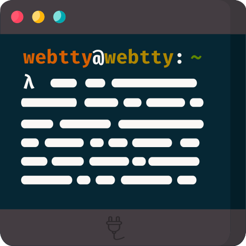

<h1 align="center">
    
    <br />
    <br />
</h1>

> Terminal emulator build on top of WebSockets

[![Build status][ci-badge]][ci-url]
[![NuGet][nuget-package-badge]][nuget-package-url]
[![feedz.io][feedz-package-badge]][feedz-package-url]
[![coverage][coverage-badge]][coverage-url]


## Introduction
WebTTY is a cross-platform CLI tool allowing a user to get access to a terminal via any supported browser.

## Install

You can easily install the application as a dotnet tool with the following command (for this you will need to have the dotnet [.NET Core SDK](https://dotnet.microsoft.com/download) installed):

```
dotnet tool install -g webtty
```

## Usage

```
λ webtty --help

🔌 WebSocket based terminal emulator

Usage: webtty [options] -- [command] [<arguments...>]

Options:
  -a, --address=VALUE        IP address to use [localhost]. Use any to listen
                               to any available address. Ex (0.0.0.0, any, 192.
                               168.2.3, ...)
  -s, --unix-socket=VALUE    Use the given Unix domain socket path for the
                               server to listen to
  -p, --port=VALUE           Port to use [5000]. Use 0 for a dynamic port.
      --path=VALUE           Path to use, defaults to /tty
      --version              Show current version
  -?, -h, --help             Show help information
```

[ci-url]: https://github.com/nickvdyck/webtty
[ci-badge]: https://github.com/nickvdyck/webtty/workflows/CI/badge.svg

[nuget-package-url]: https://www.nuget.org/packages/webtty/
[nuget-package-badge]: https://img.shields.io/nuget/v/webtty.svg?style=flat-square&label=nuget

[feedz-package-url]: https://f.feedz.io/nvd/webtty/packages/webtty/latest/download
[feedz-package-badge]: https://img.shields.io/badge/endpoint.svg?url=https%3A%2F%2Ff.feedz.io%2Fnvd%2Fwebtty%2Fshield%2Fwebtty%2Flatest&label=webtty

[coverage-url]: https://codecov.io/gh/nickvdyck/webtty
[coverage-badge]: https://codecov.io/gh/nickvdyck/webtty/branch/master/graph/badge.svg
